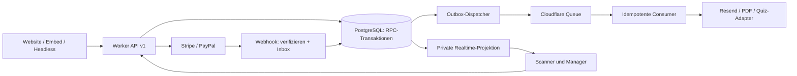

# Ticketing: technisches Audit und Modernisierungsplan

Stand: 23.09.2026. Untersucht: lokaler Workspace, Git-HEAD `4344a19` (18.09.2026) sowie vorhandene unversionierte Varianten. Auftrag: Analyse und Plan; keine Änderung am Produktivcode, keine Buchungen, Deployments oder Datenbankmutationen.

**Ergänzte Produktvorgaben:** Verkauf primär auf `www.kneipenkoenig.de`, kompatible Daten für Quizvorbereitung und Ticketcode-Anmeldung, Eventpflege weiterhin im Manager sowie ein zur Marke passendes Redesign. Abschnitt 8 konkretisiert diese Vorgaben und präzisiert die bisherige Embed- und Integrationsplanung.

**Nachträgliche Umfangsänderung:** Bestätigungsmail mit Ticket-PDF sowie Apple-/Google-Wallet-Pässen gehören auf Nutzerwunsch zum produktiven Erstumfang. Die frühere P3-Einstufung für Wallet in Abschnitt 6 ist damit überholt; der Gesamtaufwand muss entsprechend erweitert werden. Der neue Manager-Entwurf und seine Umsetzungslücken sind in [Manager-Design v1](<C:/Users/DerKneipenkönig/OneDrive - Lettevents/Dokumente/80 Website/docs/audit/MANAGER-DESIGN-V1.md>) dokumentiert.

**Erster Umsetzungsschritt abgeschlossen:** Anschlussprüfung der lokalen Manager-/Quiz-Repositories, konkreter v1-Registration-Vertrag und lokaler Designprototyp liegen vor. Details in [Integrationsvertrag und Prüfstand](<C:/Users/DerKneipenkönig/OneDrive - Lettevents/Dokumente/80 Website/docs/audit/TICKETING-INTEGRATION-V1.md>). Die ursprünglichen Grenzen dieses Audits bleiben für Live-Deployments und aktive Datenbankregeln bestehen.

## 1. Entscheidung und Top 3

**Das eigene Ticketing ist in den untersuchten Implementierungen noch nicht für einen verlässlichen produktiven Zahlungsbetrieb freigabefähig.** Die vorhandenen Dienste können weiterverwendet werden. Entscheidend sind transaktionale Geschäftsregeln und ein eindeutig reproduzierbarer Softwarestand.

1. **Zahlungsintegrität (P0):** Zwei alternative Worker bestätigen kostenpflichtige Bestellungen durch den vom Client frei wählbaren Wert `payment_method: free` als bezahlt. Zusätzlich stimmt die Stripe-Metadaten-Zuordnung in der konfigurierten Quelle und im Bundle nicht; erfolgreiche Zahlungen können ohne Bestellaktualisierung quittiert werden.
2. **Kontingentintegrität (P0):** Lesen der Verfügbarkeit, Generieren der Bestellnummer, Anlegen der Bestellung und Verbrauchen eines Gutscheins sind getrennte Requests. Keine transaktionale Reservierung, keine Ablaufzeit, keine sichere Rückabwicklung: Overselling, hängende Kontingente und konkurrierende Bestellnummern sind möglich.
3. **Kein konsistenter Ticket-Lifecycle (P0/P1):** Konfigurierter Worker, Bundle, SQL und zwei Frontends sprechen unterschiedliche Verträge. Die Bestätigungsseite verlangt öffentlichen Bestellzugriff trotz restriktiver RLS und erzeugt einen QR-Code ohne den vorgesehenen Token. Ein autorisierter, atomarer Check-in ist hier nicht implementiert.

P0 = vor Freigabe beheben; P1 = unmittelbar folgender Kernumbau; P2 = Integration/Betriebsverbesserung; P3 = Komfort. Die Priorität beschreibt das Risiko des Codes, nicht einen nachgewiesenen Angriff auf das Livesystem.

## 2. Untersuchungsumfang und Nachweisgrenzen

Gelesen wurden Ticketing-SQL einschließlich Varianten, alle drei Worker-Implementierungen und Payment-/Mail-/DB-Module, Checkout in [index.html](<C:/Users/DerKneipenkönig/OneDrive - Lettevents/Dokumente/80 Website/index.html>) und [ticketing.html](<C:/Users/DerKneipenkönig/OneDrive - Lettevents/Dokumente/80 Website/ticketing.html>), Bestätigungsseite, Paket-/Lockdateien, CI-Konfiguration und vorhandener Homepage-Test. Manager und Scoremaster sind verknüpfte andere Anwendungen; deren Backend und Berechtigungen liegen nicht in diesem Repository.

Der tatsächliche Cloudflare-Deploy, die aktiven Supabase-Policies/Migrationen, Provider-Konten, Secret-Werte und historische Zahlungsdaten wurden nicht inspiziert. Deshalb gelten Aussagen über diese Systeme als Prüfauftrag. Die Dateibezeichnung `SB_SERVICE_KEY` auf der Bestätigungsseite ist irreführend: Der sichtbare Wert ist ein **Publishable Key**, kein Beleg für ein veröffentlichtes Service-Secret.

Reproduzierbare lokale Prüfungen: `node docs/audit/ticketing-probes.mjs`. Alle Netzwerkaufrufe werden abgefangen; echte Datenbanken und Provider werden nicht angesprochen. Vier erfolgreiche Charakterisierungen dokumentieren bestehende Fehler: Free-Bypass in zwei Varianten, Stripe-Webhook ohne Bestellupdate, zwei akzeptierte Buchungen desselben letzten Platzes bei simulierter Parallelität. Letzteres ist kein PostgreSQL-Lasttest. Die Prüfungen sind Defektnachweise und müssen nach Behebung durch Erwartungen an korrektes Verhalten ersetzt werden.

`npm audit --json` und `npm outdated --json` wurden in Root und Worker ausgeführt. Keine automatische Dependency-Reparatur. Die vorhandenen Homepage-Browsertests wurden gelesen, nicht ausgeführt; sie mocken Payment und DB und können die Kernprobleme nicht ausschließen.

## 3. Phase 1 – erkannter Stack und Architektur

| Bereich | Tatsächlich gefunden | Einordnung |
|---|---|---|
| Website | HTML, CSS, JavaScript, umfangreiche Inline-Skripte | Kein React/Vue/Next; mehrere Checkout-Oberflächen |
| API | Cloudflare Worker, JavaScript ES-Module, Fetch/Web Crypto | Serverless HTTP-Backend; Routing und Geschäftsabläufe überwiegend in einer Datei |
| Daten | Supabase PostgreSQL, PostgREST, SQL-RPC, RLS | Kein ORM; selbst geschriebener REST-Client mit Service-Berechtigung |
| Payment | Stripe Checkout und PayPal REST über `fetch` | Keine Stripe-/PayPal-SDK-Abhängigkeit; Signaturprüfung selbst implementiert |
| Versand | Resend REST, HTML-Templates | Synchron im Request; kein persistenter Versandauftrag |
| Hintergrundarbeit | Keine Queue-/Cron-Bindings in Wrangler, kein `queue`-/`scheduled`-Handler im Ticketing | Cloudflare Workers allein sind noch kein Jobsystem |
| QR/PDF | CDN-Skript `qrcode@1.5.3`, Canvas in Bestätigungsseite | Kein Ticket-PDF-Generator, kein Wallet-Service gefunden |
| Tooling | Wrangler 3.114.17 im Lock, Root `sharp` 0.34.5 | Node für Werkzeuge, nicht als eigener Backend-Server |
| Weitere Integration | MSAL Browser 2.38.3 in lokaler Minified-Datei, Scoremaster-/Manager-Embeds, Ticket-Tailor-Proxy | MSAL dient Website-Admin; kein Nachweis einer Ticketing-API-Autorisierung |
| Hosting/CI | Cloudflare Pages laut Projektnotiz, GitHub Actions für Galerie/Testimonials | Keine Ticketing-Migrations-/Payment-Testpipeline gefunden |

Architekturmuster: statische Website mit separatem serverlosem Backend und Managed Database. Fachlich ein kleiner Monolith mit externen Diensten, keine Microservice-Landschaft. Payment-Transport und Datenzugriff sind teilweise in Module ausgelagert; Reservierung, Zahlung, Rabatt und Mail sind aber eng gekoppelt. UI greift parallel direkt auf Supabase und Worker zu.

### 3.1 Varianten und Vertragsdrift

| Stand | Vertragsannahme | Folge |
|---|---|---|
| [workers/kk-ticketing/wrangler.toml:2](<C:/Users/DerKneipenkönig/OneDrive - Lettevents/Dokumente/80 Website/workers/kk-ticketing/wrangler.toml:2>) → [src/index.js](<C:/Users/DerKneipenkönig/OneDrive - Lettevents/Dokumente/80 Website/workers/kk-ticketing/src/index.js>) | Event hat `max_tickets`, `price`, `currency`; RPC `available_tickets` | Passt eher zum unversionierten [supabase-ticketing-schema-KNEIPENKOENIG.sql](<C:/Users/DerKneipenkönig/OneDrive - Lettevents/Dokumente/80 Website/supabase-ticketing-schema-KNEIPENKOENIG.sql>) |
| Versioniertes [supabase-ticketing-schema.sql](<C:/Users/DerKneipenkönig/OneDrive - Lettevents/Dokumente/80 Website/supabase-ticketing-schema.sql>) | Preis/Kapazität pro Ticket-Typ; `allow_cash`; RPC `get_event_availability` | Kein `events.price/max_tickets/currency`, kein `available_tickets` |
| Versioniertes [workers/kk-ticketing-cloudflare.js](<C:/Users/DerKneipenkönig/OneDrive - Lettevents/Dokumente/80 Website/workers/kk-ticketing-cloudflare.js>) | Ticket-Typ-Modell; Availability liefert `{event,ticket_types,sold_out}` | Entspricht dem neueren Homepage-Checkout, ist aber nicht Wrangler-Entry |
| Unversioniertes [workers/kk-ticketing-worker.js](<C:/Users/DerKneipenkönig/OneDrive - Lettevents/Dokumente/80 Website/workers/kk-ticketing-worker.js>) | Weiterer eigenständiger Entwurf, `/capture-paypal`, Stripe-Antwort `url` | Andere Route, andere Response; Homepage erwartet `success`/`checkout_url` |
| [ticketing.html:285](<C:/Users/DerKneipenkönig/OneDrive - Lettevents/Dokumente/80 Website/ticketing.html:285>) | Event-Preis/-Kapazität und skalare Availability | Veraltet gegenüber Ticket-Typ-Modell |
| [index.html:2847](<C:/Users/DerKneipenkönig/OneDrive - Lettevents/Dokumente/80 Website/index.html:2847>) | Eigene Events und eigenes Checkout zusätzlich zu Ticket Tailor | Aussage in CLAUDE.md, Homepage habe nur Ticket Tailor, ist überholt |

Weitere `-KNEIPENKOENIG`-Dateien sind lokale Varianten, kein belastbares Migrationssystem. Nicht pauschal löschen: zunächst mit Deploy-Artefakt und Historie abgleichen. Ein `wrangler deploy` aus dem Unterprojekt kann derzeit einen anderen Vertrag ausrollen als denjenigen, den die Homepage nutzt.

### 3.2 Dependency- und Betriebssicherheit

Audit-Ergebnis am Untersuchungstag:

| Paketbaum | Ergebnis | Maßnahme |
|---|---|---|
| Root | 1 betroffenes Paket, Schwere hoch: `sharp` 0.34.5 | 0.35.4 wurde als aktuelle/behebende Version gemeldet; Bildverarbeitung gegen echte Formate testen |
| Worker-Toolchain | 7 betroffene Pakete: 5 hoch, 2 mittel | `defu`, `esbuild`, `miniflare`, `sharp`, `undici`, `wrangler`, `ws`; kontrollierter Wrangler-v4-Wechsel |
| Wrangler | Installiert 3.114.17; npm meldet 4.136.3 aktuell | Nicht durch `^3.0.0` abgedeckt; Upgrade mit Lockfile, Runtime- und Deploy-Test |

Das sind Paketmeldungen, keine sieben unabhängig ausnutzbaren Produktionslücken. Der Worker hat keine npm-Laufzeitabhängigkeiten; viele Treffer betreffen Entwicklungsserver/Toolchain. Beispiele der gemeldeten Advisories: [esbuild Entwicklungsserver](https://github.com/advisories/GHSA-67mh-4wv8-2f99), [sharp/libvips](https://github.com/advisories/GHSA-f88m-g3jw-g9cj), [sharp/libheif](https://github.com/advisories/GHSA-rgj7-g3m4-5g8c). Migration anhand der [Cloudflare-Anleitung](https://developers.cloudflare.com/workers/wrangler/migration/), danach Audit erneut bewerten. Vendored MSAL und CDN-QR liegen außerhalb dieser npm-Abdeckung; Alter allein beweist dort keine konkrete CVE.

Secrets werden im Worker über `env` gelesen, das ist eine brauchbare Grundlage. Es fehlen aber getrennte Staging-/Live-Umgebungen und eine validierte Konfiguration. [src/paypal.js:5](<C:/Users/DerKneipenkönig/OneDrive - Lettevents/Dokumente/80 Website/workers/kk-ticketing/src/paypal.js:5>) ist fest auf Live gesetzt, während das Bundle Sandbox als Standard nutzt; die Notiz „aktuell Test“ ist keine Sicherheit. `PAYPAL_WEBHOOK_ID` wird benötigt, aber in der Secret-Liste der Wrangler-Datei nicht genannt. `compatibility_date` ist 2024-12-01; Änderung gezielt testen, nicht blind aktualisieren.

Fehler werden häufig als `err.message` inklusive Provider-/DB-Details an Besucher ausgegeben. Mailfehler werden geschluckt, Logs enthalten Empfängeradressen, Request-/Order-Korrelation und Alarme fehlen. `.gitignore` ignoriert nur Worker-node_modules; Regeln für `.env*`, `.dev.vars*`, Build-Artefakte und Root-node_modules ergänzen. Ein Secret-Leak wurde damit nicht nachgewiesen.

## 4. Phase 2 – kritisches Kernaudit

### F01 · P0 · Kostenpflichtig wird durch Clientwert kostenlos bestätigt

Beleg: Bundle [workers/kk-ticketing-cloudflare.js:558](<C:/Users/DerKneipenkönig/OneDrive - Lettevents/Dokumente/80 Website/workers/kk-ticketing-cloudflare.js:558>), alternative Quelle [workers/kk-ticketing-worker.js:371](<C:/Users/DerKneipenkönig/OneDrive - Lettevents/Dokumente/80 Website/workers/kk-ticketing-worker.js:371>). `effectiveMethod = totalAmount === 0 ? 'free' : payment_method`; anschließend gilt `free` als `paid`. Ein Request mit gültigem kostenpflichtigem Ticket und `free` genügt. Offline mit 25 EUR reproduziert. Der konfigurierte [src/index.js](<C:/Users/DerKneipenkönig/OneDrive - Lettevents/Dokumente/80 Website/workers/kk-ticketing/src/index.js>) besitzt diesen konkreten Bypass nicht, legt für unzulässige Methoden aber bereits eine Bestellung an, bevor er sie ablehnt.

Fix: Zahlmethoden vor Seiteneffekten validieren; `free` ausschließlich serverseitig aus einem geprüften Gesamtbetrag null ableiten. Bei positivem Betrag `free` ablehnen. `bar` nur bei `event.allow_cash`; das fehlt in [src/index.js](<C:/Users/DerKneipenkönig/OneDrive - Lettevents/Dokumente/80 Website/workers/kk-ticketing/src/index.js>). Keine Freigabe allein auf Basis der UI-Auswahl.

### F02 · P0 · Kein atomarer Bestand und kein Reservierungsablauf

Beleg: [src/index.js:188](<C:/Users/DerKneipenkönig/OneDrive - Lettevents/Dokumente/80 Website/workers/kk-ticketing/src/index.js:188>) liest Availability, `:239` schreibt separat. Bundle ebenso; SQL `get_event_availability` summiert `pending` und `paid`. A und B können denselben Restbestand sehen und anschließend beide bestellen. Ein Unique-Key auf der Bestellnummer ist kein Bestandslock: Er verhindert nur identische Nummern und verursacht dann Fehler.

Abbruch, Provider-Timeout oder ungültige Methode können `pending` dauerhaft zurücklassen. Es gibt kein `expires_at`, keine Ablaufverarbeitung. Barzahlung wird ebenfalls `pending` genannt und ist von abgebrochenen Onlinezahlungen nicht sauber unterscheidbar. `next_order_number()` verwendet `MAX + 1` ([supabase-ticketing-schema.sql:197](<C:/Users/DerKneipenkönig/OneDrive - Lettevents/Dokumente/80 Website/supabase-ticketing-schema.sql:197>)) und kollidiert bei Parallelität.

Fix: eine PostgreSQL-Transaktion für Inventar, Order, Rabattreservierung; Sequenz/Identity statt `MAX + 1`; explizite Zustände. Redis ist dafür zunächst unnötig. Event-Gesamtkapazität und Ticket-Typ-Kapazität müssen gemeinsam gelten: sechs Personen pro Team sind nicht sechs verkaufte Teamtickets. Kapazitätsregeln für Personen, Teams und Tische explizit modellieren.

### F03 · P0 · Stripe-Zahlung und Bestellung nicht zuverlässig verbunden

Beleg: [src/stripe.js:15](<C:/Users/DerKneipenkönig/OneDrive - Lettevents/Dokumente/80 Website/workers/kk-ticketing/src/stripe.js:15>) setzt nur `payment_intent_data[metadata]`; [src/index.js:389](<C:/Users/DerKneipenkönig/OneDrive - Lettevents/Dokumente/80 Website/workers/kk-ticketing/src/index.js:389>) sucht Metadaten am Session-Objekt bzw. an `session.payment_intent`, das typischerweise eine ID ist. Bundle setzt ebenfalls nur PI-Metadaten (`:103`), liest Session-Metadaten. Offline: korrekt signiertes `checkout.session.completed` wird mit 200 quittiert, ohne Bestellung zu aktualisieren.

Session-ID und PaymentAttempt persistent speichern; `metadata[order_id]` direkt auf Session plus PaymentIntent setzen. Betrag, Währung, Provider-Zuordnung, Live-/Testmodus und tatsächlichen Zahlungsstatus prüfen. Für verzögerte Zahlarten eigene Erfolgs-/Fehlerereignisse behandeln. Eine Rückkehr auf die Erfolgseite ist keine Zahlungsbestätigung. [Stripe Fulfillment](https://docs.stripe.com/checkout/fulfillment), [Metadaten](https://support.stripe.com/questions/using-metadata-with-checkout-sessions).

### F04 · P0/P1 · Keine belastbare Idempotenz oder Refund-Zustandsmaschine

Provider-Aufrufe haben weder Stripe-Idempotency-Key noch `PayPal-Request-Id`. Kein Client-Idempotency-Key, kein Unique-Constraint auf Provider-Ereignissen/-Zahlungen. Wiederholte Webhooks schreiben erneut und können erneut mailen; späte „paid“-Events können refundierte Bestellungen wieder auf bezahlt setzen. Ein doppelter Webhook belastet nicht automatisch doppelt, aber ein wiederholter Checkout kann neue Orders/Payments anlegen.

`charge.refunded` setzt die gesamte Order auf `refunded`, ohne Teilbetrag zu unterscheiden ([src/index.js:407](<C:/Users/DerKneipenkönig/OneDrive - Lettevents/Dokumente/80 Website/workers/kk-ticketing/src/index.js:407>)). Dadurch wird beim nächsten Availability-Read die ganze Menge frei. Refund, Storno und Ticketwiderruf sind getrennte fachliche Vorgänge; eine Kulanz-Teilerstattung muss kein Ticket freigeben. Im PayPal-Webhook fehlt der Bestätigungsversand bei erfolgreicher Zahlung; die Zuordnung von Refunds ausschließlich über `related_ids.order_id` ist anhand echter Sandbox-Events zu prüfen.

Fix: persistente Inbox/Outbox, deduplizierte Transaktionen, getrennte Refund-Ledger, periodischer Provider-Abgleich und manuelle Klärungswarteschlange. [Stripe-Webhooks](https://docs.stripe.com/webhooks), [PayPal-Idempotenz](https://developer.paypal.com/api/make-api-requests).

### F05 · P0 in alternativer Variante · PayPal vertraut falscher Zuordnung

[workers/kk-ticketing-worker.js:570](<C:/Users/DerKneipenkönig/OneDrive - Lettevents/Dokumente/80 Website/workers/kk-ticketing-worker.js:570>) verarbeitet Approval-Webhooks ohne Signaturprüfung und löst Capture aus. `/capture-paypal` (`:728`) übernimmt außerdem die lokale `order_id` vom Client getrennt von `paypal_order_id`; nach erfolgreicher Capture wird diese frei gewählte Order bezahlt markiert, ohne Betrags-/Zuordnungsprüfung. Die anderen beiden Varianten verifizieren über PayPal und verwenden eine gespeicherte Provider-ID, besitzen diesen konkreten Fehler also nicht. Diese alternative Datei nicht als Ersatz deployen. [PayPal-Verifikation](https://developer.paypal.com/api/rest/webhooks/rest/).

### F06 · P1 · Rückkehr, Bestellzugriff und QR sind unvollständig

[ticketing.html:409](<C:/Users/DerKneipenkönig/OneDrive - Lettevents/Dokumente/80 Website/ticketing.html:409>) sendet `{ORDER}` als Platzhalter; der Worker ersetzt ihn nicht. Homepage nutzt den Backend-Standard und hat diesen speziellen Fehler nicht. Ein vollständiger PayPal-Rückkehr-/Capture-Flow fehlt in beiden Frontends; simples Weiterleiten nach `checkoutnow` schließt ihn nicht ab.

[buchung-bestaetigt.html:253](<C:/Users/DerKneipenkönig/OneDrive - Lettevents/Dokumente/80 Website/buchung-bestaetigt.html:253>) liest `orders?select=*` mit Publishable Key und erratbarer Bestellnummer. Nach dem eingecheckten SQL ist das durch RLS verboten: **Funktionsfehler**, kein nachgewiesener Datenabfluss. Würde zur Reparatur öffentliches SELECT erlaubt, wären Namen, E-Mail, Telefon und Bestellungen enumerierbar. Stattdessen ein zweckgebundenes Bestellzugriffstoken und minimalen Worker-Endpunkt einführen.

[buchung-bestaetigt.html:330](<C:/Users/DerKneipenkönig/OneDrive - Lettevents/Dokumente/80 Website/buchung-bestaetigt.html:330>) codiert `{order,id,team,qty}`. Der zufällige DB-Wert `qr_code` wird nicht verwendet. Unsigned JSON ist manipulierbar; ob ein externer Scanner ihm vertraut, ist unbekannt. Das gespeicherte UUID-basierte Token ist nicht automatisch unsicher, weil es kein JWT ist: ein ausreichend zufälliges, serverseitig geprüftes Bearer-Token ist für Online-Check-in geeignet. Es muss jedoch tatsächlich verwendet und bei Bedarf widerrufen werden.

Kein Ticket pro erworbener Einheit, nur ein Check-in-Bool pro Order. Keine Teilankunft, Scanner-Rolle, Scan-Historie oder atomare Doppel-Scan-Abwehr im Repo. QR/PDF/Wallet dürfen niemals selbst die maßgebliche Quelle für Bezahlt-/Gültigkeitsstatus sein. Bestätigungsseite zeigt aktuell auch bei `pending/cancelled/refunded` pauschal „Platz gesichert“ und einen QR-Bereich.

### F07 · P1 · Eingaben, HTML und Service-Zugriffe

Keine strikten UUID-, Integer-, E-Mail-, Längen- oder Payload-Grenzen. `quantity || 1` ersetzt auch null/0; negative Werte scheitern erst an der DB. Ticket-Typ-Zugehörigkeit wird im konfigurierten Worker bei fehlendem Treffer nicht konsequent abgelehnt. Preise/Prozente besitzen unvollständige DB-Checks. Floating-Point-Beträge vermeiden; Cent als Integer und explizite Währung verwenden.

[src/supabase.js:8](<C:/Users/DerKneipenkönig/OneDrive - Lettevents/Dokumente/80 Website/workers/kk-ticketing/src/supabase.js:8>) hängt Filterrohtexte in URLs. Nutzereingaben können mit `&` weitere PostgREST-Parameter einschleusen. Das ist URL-/Filtermanipulation, nicht nachgewiesene SQL-Injection. Mit Service-Rolle ist die Grenze besonders wichtig: typisierte IDs, `URLSearchParams`/SDK und feste Abfrageformen verwenden.

Direkte HTML-Interpolation in Bestätigungsseite und Mailtemplates; besonders `orderNumber` aus URL in [buchung-bestaetigt.html:348](<C:/Users/DerKneipenkönig/OneDrive - Lettevents/Dokumente/80 Website/buchung-bestaetigt.html:348>) ist ein DOM-XSS-Sink auch im Fehlerpfad. `textContent` bzw. kontextgerechtes Escaping, keine ungeprüften Templatewerte. Kunden-Redirects serverseitig auf eigene Ziele begrenzen. CORS reflektiert jeden Origin ([src/index.js:44](<C:/Users/DerKneipenkönig/OneDrive - Lettevents/Dokumente/80 Website/workers/kk-ticketing/src/index.js:44>)); eine Allowlist reduziert Browserzugriffe, ersetzt aber keine Authentisierung, Rate-Limits oder Bot-Abwehr.

`get_event_availability` ist `SECURITY DEFINER` ohne expliziten `search_path`/EXECUTE-Einschränkung und ohne Published-Filter in der Funktion. Damit ist die öffentliche Tabellen-RLS nicht automatisch auch die RPC-Schutzgrenze. Öffentliche RPC nur mit geprüfter Projektion; Mutations-RPC ausschließlich intern und mit festen Berechtigungen. [Supabase-Funktionen](https://supabase.com/docs/guides/database/functions).

### F08 · P1/P2 · Rabatte, Warteliste, E-Mail

Rabattzähler werden gelesen und mit `+1` geschrieben: verlorene Updates und Limitüberschreitung; Verbrauch erfolgt bereits vor erfolgreicher Zahlung. Im konfigurierten Worker fehlen gespeicherter Rabattcode/-betrag trotz Anwendung. `max_uses = 0` wird durch Truthiness wie unbegrenzt behandelt. Keine Begrenzung pro Kunde, keine Redemption-Historie.

Warteliste erlaubt öffentliches INSERT mit `WITH CHECK(true)`; Spam, Dubletten und beliebige weitere erlaubte Spalten sind nicht fachlich eingeschränkt. Benachrichtigung setzt `notified=true` vor Versand und reserviert keinen Platz. Kapazitätserhöhungen lösen hier nichts aus. E-Mail-HTTP-Fehler können verloren gehen; `email_sent` wird in den modularen/bundled Mailpfaden nicht als verlässliche Versandhistorie gepflegt.

Checkout in [src/index.js](<C:/Users/DerKneipenkönig/OneDrive - Lettevents/Dokumente/80 Website/workers/kk-ticketing/src/index.js>) lädt für kostenlose/Bar-Bestätigung keine Event-Datums-/Venue-Felder, obwohl das Template sie benötigt. Serverzeitzone ist nicht ausdrücklich Europe/Berlin. Versandstatus, Bounce-Zustand und Buchungserfolg trennen.

## 5. Phase 3 – Architektur-Sollzustand

**Empfehlung: modularer TypeScript-Monolith auf Cloudflare Workers, PostgreSQL als einzige maßgebliche Instanz für Bestand und Ticketstatus.** Website/Pages, Supabase und Resend bleiben. Keine neue Microservice-Landschaft und vorerst kein Redis-Doppelbestand.



Module: `catalog`, `inventory`, `orders`, `payments`, `tickets`, `checkin`, `teams`, `promotions`, `notifications`, `integrations`. HTTP-Handler validieren/autorisierten; Application Services koordinieren; SQL-RPC sichern Invarianten; Provider-Adapter enthalten HTTP-Details. Ein Build aus einer Quelle, kein separat handgepflegtes Bundle.

Werkzeugvorschlag: TypeScript strict; Hono plus Zod/OpenAPI für Routen und generierte Clients ([offizielles Beispiel](https://hono.dev/examples/zod-openapi)); Supabase-JS mit generierten DB-Typen für Transport, SQL-Migrationen und pgTAP für Invarianten. Kein ORM-Zwang. Offizielles Stripe-SDK ersetzt eigene Signatur-/Request-Helfer, Worker-Kompatibilität im Staging prüfen. PayPal bleibt ein kleiner typisierter REST-Adapter mit Request-ID. Vitest/Workers-Testumgebung, Playwright für Kaufabläufe, k6 für Staging-Last. Versionen beim Umsetzungsstart gemeinsam pinnen und testen.

Queue erst nach dauerhaftem DB-Outbox-Commit bedienen. Dispatcher nutzt Lease und Retry; Absturz nach Publish kann erneut publizieren, Consumer deduplizieren über Event-ID. Cloudflare garantiert mindestens einmalige Zustellung, keine Exactly-once-Verarbeitung ([Queues](https://developers.cloudflare.com/queues/reference/delivery-guarantees/)). Webhook-200 erst nach dauerhaft gespeichertem Event; bei DB-Ausfall 5xx. Keine E-Mail im Webhook-Pfad.

Konfiguration: getrennte Supabase-/Stripe-/PayPal-/Resend-Umgebungen; erforderliche Secrets beim Start prüfen; pro Release Commit, Schema-Version und Provider-API-Version dokumentieren. JSON-Logs mit `request_id/order_id/payment_attempt_id`, keine Tokens oder Kundenadressen. Metriken: unzugeordnete Zahlung, Alter der Inbox/Outbox, Hold-Ablauf, Refund-Fehler, Differenz zwischen Provider und DB, Queue-DLQ. Betriebsziel für Pilot: null Überverkäufe, null unzugeordnete bezahlte Bestellungen; Check-in p95 <1 s und Live-Anzeige <2 s unter vereinbarter Standortlast, als Ziel erst noch zu messen.

### 5.1 Konkretes Datenmodell

| Entität | Wesentliche Felder/Constraints |
|---|---|
| `orders_v2` | UUID, eindeutige Sequenznummer, event_id, Kundenbezug, currency, total_minor ≥0, order_status, payment_status, version |
| `order_items` | order_id, ticket_type_id, quantity >0, price_minor ≥0, discount_minor, Snapshot des Ticketnamens/Regeln |
| `inventory_buckets` | Event-/Typ-/Tisch-/Personen-Kontingent, capacity, held, committed, CHECK held+committed ≤ capacity |
| `reservations` / `reservation_allocations` | Order, Bucket, units, state, expires_at; jede Zustandsänderung und Zählerbewegung zusammen |
| `payment_attempts` | Provider, eindeutige Request-ID, externe Session-/Order-/Capture-IDs, Sollbetrag/Währung, Zustand |
| `payment_events` | UNIQUE(provider, provider_event_id), Payload/Hash, received_at, processed_at, Retry-Zustand |
| `refunds` | Payment, Betrag, Provider-Refund-ID UNIQUE, Grund und Status; Widerruf separat |
| `tickets` | order_item_id, ordinal, event_id, token_hash UNIQUE, status; UNIQUE(order_item_id,ordinal) |
| `event_teams` | stabile UUID, event_id, Name, group_size, version; Name ist kein Identitätsschlüssel |
| `team_registrations` | Ticket/Team-Bezug, Quiz-Raum, externes Team-Mapping, Sync-Zustand |
| `seat_allocations` | Event/Tisch/Sitz, Registration; aktiver Sitz pro Event eindeutig, Tischkapazität separat |
| `checkin_events` | ticket_id, actor_id, device_id, action, occurred_at, request_id UNIQUE |
| `promo_redemptions` | code_id, order_id UNIQUE, customer_id, Zustand hold/consumed/released |
| `waitlist_offers` | Eintrag, passendes Ticket/Größe, reserviertes Kontingent, Ablauf, Token-Hash |
| `outbox` / `deliveries` | event_id/dedupe_key UNIQUE, Typ, payload, Lease, Retry, next_attempt_at, sent_at |
| `access_grants` | Token-Hash, purpose, subject_id, expires_at, used_at, revoked_at |

Order-Zustände `draft → reserved → confirmed → cancelled`; Zahlung separat `unpaid → pending → paid → partially_refunded/refunded`, außerdem `failed`. Barzahlung ist `confirmed + unpaid`, gegebenenfalls Kassenfreigabe vor Einlass. Ticketgültigkeit folgt der Einlassregel, nicht pauschal `payment_status == paid`.

Beispiel für eine Kapazitätsmutation **innerhalb einer einzigen RPC-Transaktion**, kein direktes Frontend-SQL:

```sql
CREATE TABLE ticketing_inventory_example (
  id uuid PRIMARY KEY,
  capacity integer NOT NULL CHECK (capacity >= 0),
  held integer NOT NULL DEFAULT 0 CHECK (held >= 0),
  committed integer NOT NULL DEFAULT 0 CHECK (committed >= 0),
  CHECK (held + committed <= capacity)
);

-- p_units zuvor als positive Ganzzahl validieren.
UPDATE ticketing_inventory_example
SET held = held + p_units
WHERE id = p_bucket_id
  AND p_units > 0
  AND capacity - held - committed >= p_units
RETURNING id;
-- Kein Treffer: Exception auslösen, gesamte RPC zurückrollen.
-- Danach Reservation, Order, Rabatt-Hold und Outbox in derselben Transaktion.
```

Die bedingte Mutation serialisiert konkurrierende Schreiber am Datensatz. Bei mehreren Buckets in stabiler ID-Reihenfolge sperren, alle prüfen, bei einem Fehlschlag alles zurückrollen. Wiederholte Checkout-Requests zuerst mit UNIQUE(scope,idempotency_key) und Payload-Hash auf dieselbe Order führen; geänderte Payload mit gleichem Key ergibt 409. Mutationsfunktionen feste `search_path`, explizit qualifizierte Tabellen, EXECUTE für PUBLIC/anon/authenticated entziehen und nur Backend-Service erlauben. [PostgreSQL-Sperren](https://www.postgresql.org/docs/17/explicit-locking.html).

Provider-Aufrufe liegen außerhalb der DB-Transaktion. `payment_attempt` wird vor dem Aufruf angelegt; Timeout bedeutet „Ausgang unbekannt“, nicht automatisch gescheitert. Wiederholung mit demselben Provider-Key oder Statusabfrage. Neues Attempt erst nach geklärtem Vorgänger; verhindert zwei zahlbare Checkouts pro Hold.

Hold-TTL an Provider-Laufzeit ausrichten. Zum Freigeben erst Session/Capture-Zustand klären bzw. Checkout schließen; bei unklarem Status Hold nicht blind freigeben. Expiry-Job und Zahlungsfinalisierung sperren dieselbe Reservation und bewegen `held/committed` genau einmal. Zahlung nach bereits freigegebenem Hold: keine Überbuchung erzwingen; atomar neu reservieren oder Refund-/Klärungsprozess auslösen. Verzögerte Zahlarten erst aktivieren, wenn diese Regeln getestet sind.

Schema- und Codebeispiele sind Entwürfe, keine bereits ausgeführten Migrationen.

### 5.2 Payment- und Webhook-Vertrag

```ts
// Konzept: createAttemptOnce/repository-RPCs sind noch zu implementieren.
const attempt = await createAttemptOnce(order.id, idempotencyKey, payloadHash);
const session = await stripe.checkout.sessions.create({
  mode: 'payment',
  line_items: [{ price_data: { currency: order.currency,
    unit_amount: order.totalMinor,
    product_data: { name: order.eventTitle } }, quantity: 1 }],
  metadata: { order_id: order.id, attempt_id: attempt.id },
  payment_intent_data: { metadata: { order_id: order.id } },
  success_url: configuredReturnUrl, // Zugang über separates Bestelltoken
  cancel_url: configuredCancelUrl
}, { idempotencyKey: `checkout:${attempt.id}` });
await bindProviderSession(attempt.id, session.id);
```

Eingehend: Raw Body verifizieren → Event eindeutig in Inbox schreiben → ACK. Consumer lädt Provider-Status und prüft Mapping/Betrag/Währung/Account → sperrt Order/Reservation → finalisiert Zahlung, Tickets und Outbox atomar → markiert Inbox verarbeitet. Auch bereits verarbeitete Events mit anderer Event-ID dürfen keine zweite Ticketausstellung auslösen. E-Mail-Dedupe z.B. `order-confirmed:<order-id>:v1`; zusätzlich Provider-Idempotenz nutzen. Resend speichert Keys 24 Stunden, deshalb bleibt die eigene Versandhistorie erforderlich ([Resend](https://resend.com/changelog/idempotency-keys)).

### 5.3 Website: Embed und Headless

**Erster Integrationsweg: kleines Loader-Skript und iFrame auf eigener Ticket-Domain.** CSS der Hostseite kann nicht in das Checkout hineinwirken. Themes nur über validierte Designparameter; Keyboard-Fokus, mobile Höhe, verständliche Fehler und Link zum eigenständigen Checkout. Payments im Top-Level-Checkout öffnen, damit Redirects und Browserrestriktionen den Embed nicht brechen.

```html
<!-- Zielvertrag; Domain und Datei erst noch einzurichten -->
<div data-kk-event="EVENT_UUID" data-kk-theme="dark"></div>
<script defer src="https://tickets.kneipenkoenig.de/embed/v1.js"></script>
```

Loader erzeugt iframe mit festem Origin, `title` und restriktiv erprobten Sandbox-Rechten. Resize/Checkout-Nachrichten nur mit geprüftem `event.origin`, `event.source`, Schema und Instanz-ID. Niemals Tokens/Kundendaten per Broadcast-`postMessage('*')`. Serverseitige `frame-ancestors`-Policy auf freigegebene Partner abstimmen. Keine Abhängigkeit von Drittanbieter-Cookies; kurzlebige zweckgebundene Checkout-Capability für den Embed. Ein Web Component mit Shadow DOM kann später native Eventkarten liefern, bietet aber nicht dieselbe Isolation für Zahlungs-/Zugriffsdaten.

**Headless: REST `/v1` mit OpenAPI zuerst.** GraphQL bringt bei diesem Umfang zusätzliche Autorisierungs-/Cachekomplexität ohne aktuellen Bedarf.

| Endpoint | Zugriff und Verhalten |
|---|---|
| `GET /v1/events?cursor=…` | Öffentliche veröffentlichte Events, Preis-/Availability-Projektion, paginiert/kurz gecacht |
| `GET /v1/events/:id/ticket-types` | Öffentlicher Katalog; Availability nur Momentaufnahme |
| `POST /v1/quotes` | Server berechnet Preis/Rabatt; keine Reservierungszusage |
| `POST /v1/checkouts` | Idempotency-Key, validierte Felder, atomarer Hold; 409 sold_out, 422 validation, 429 rate_limit |
| `GET /v1/orders/:id` | Separates Bestellzugriffstoken, minimale Projektion, `no-store` |
| `POST /v1/payments/paypal/:attemptId/capture` | Checkout-Capability; Provider-Zuordnung ausschließlich aus DB |
| `POST /v1/checkins` | Mitarbeiter-Login und Eventrolle, idempotenter Scan |
| `POST /v1/quiz/access/exchange` | Einmaliges Bridge-Token gegen enge Quiz-Session tauschen |
| `POST /v1/waitlist` | Rate-Limit, Double-Opt-in, Dedupe, eigene Feld-Allowlist |

Beispiel Checkout: `{event_id, items:[{ticket_type_id,quantity}], customer:{name,email}, team:{name,group_size}, payment_method:"stripe"}`. Antwort: `{checkout_id, order_id, status:"reserved", expires_at, total_minor, currency, checkout_url}`. Alle Preise serverseitig. White-Label-Branding nach Event/Veranstalterkonfiguration, keine frei übergebenen Redirect-Domains. Service-Key und Ticket-Tailor-Key bleiben auf dem Server.

### 5.4 Ticket-to-Session Bridge, Teams und Einlass

1. Bestätigte Order erzeugt je Teamticket eine Registration mit stabiler `event_team_id`; Käufer und Spieler sind getrennte Rollen. Ein Kauf von drei Teamtickets benötigt drei Teamzuordnungen, nicht ein globales `team_name`.
2. Outbox `registration.confirmed` upsertet im Quiz-Adapter anhand externer ID, nicht anhand Teamname. Ticketing besitzt Kauf-/Einlassstatus, Quiz-App besitzt Spielsession/Ergebnisse. Änderungen bekommen monotone Versionen; veraltete Events ignorieren. Mapping zu bestehendem Manager/Scoremaster erst mit dessen tatsächlichem API-Vertrag festlegen.
3. Mail enthält einen eigenen Magic Link: zufälliger 256-Bit-Token, in DB nur Hash, Zweck `quiz_join`, Event/Registration, Ablauf, Widerruf. Link öffnet erst eine neutrale Landingpage; Exchange erst durch ausdrückliche Nutzeraktion per POST, damit Mail-Linkscanner ihn nicht verbrauchen. Token nicht in Analytics/Logs, Referrer-Policy und bereinigte URL.
4. Exchange verbraucht Grant atomar und stellt eine kurze, auf Raum/Team/Rechte beschränkte Quiz-Session aus. Wiederholte Teilnahme über erneuten verifizierten Link; Kauf-QR gibt keine Verwaltungsrechte. Einlass und Beitritt bleiben zwei getrennte Vorgänge; nach Check-in kann derselbe Flow die Quiz-Seite anbieten.
5. Gruppengröße beim Kauf erfassen (`1..max_players`); vollständige Spielernamen nur bei Bedarf. Tisch-/Sitzzuordnung reserviert entsprechende Buckets in derselben Transaktion. Tischwechsel mit Versionsprüfung und Audit; abgesagte Tickets widerrufen Bridge-Zugang und informieren Quiz-App, ohne Ergebnisse unkontrolliert zu löschen.

Check-in verwendet `kk1.<random-token>` ohne Namen/Personenzahl im QR. Online-Scanner authentisiert Mitarbeiter und Eventrolle; RPC prüft Hash, Event, Ticketgültigkeit, Kassenvoraussetzungen und bisherigen Scan. Pro Team wahlweise einmalige Teamanmeldung oder separate Teilnehmerberechtigungen; diese Produktentscheidung muss vor Migration explizit festgelegt werden. DB-Update, Scan-Audit und Outbox werden gemeinsam committed. Parallelscans: genau einer erfolgreich, zweiter zeigt „bereits eingecheckt“ mit Zeitpunkt; Undo nur autorisiert und protokolliert.

JWT/HMAC wäre für Offline-Prüfung möglich, verhindert allein aber weder Kopieren noch gleichzeitiges Einlösen auf zwei Offline-Geräten. Zum Pilot Online-Check-in plus klar gekennzeichnete Notfallliste; keine nicht erfüllbare Offline-Doppelverwendungsgarantie.

Live-Sync über private Supabase-Realtime-Kanäle `event:<id>:checkins`; Mitarbeiter/Event-Zugriff über RLS, öffentliche Screens erhalten eine eigene datensparsame Projektion. Keine Broadcasts vollständiger Orders. Nachrichten `{event_id,registration_id,checked_in,version}`; Reconnect lädt Snapshot, veraltete Versionen verwerfen. Realtime ist Benachrichtigung, DB bleibt Wahrheit. Alternative SSE-Fassade mit Event-Cursor für Clients ohne Supabase-SDK. Websocket-Presence bedeutet nur Verbindung, niemals physische Anwesenheit. [Realtime-Autorisierung](https://supabase.com/docs/guides/realtime/authorization).

## 6. Phase 4 – priorisierte Zusatzfeatures

| Feature | Stand | Priorität/Nutzen | Konkreter Ausbau und grober Aufwand |
|---|---|---|---|
| Promocodes | Prozent/fix, Eventbindung, Zeitraum und Gesamtlimit vorhanden | P1: erst Integrität, dann Marketing | Atomare Redemptions mit Hold/Release; Rabattdeckel, Cent, Nutzer-/Eventlimits; 3–5 PT nach Kern |
| Wartelisten-Automatik | Öffentliche Tabelle und rudimentäre Refund-Mail | P2: hohe Auslastung | FIFO unter Berücksichtigung Teamgröße/Ticketart; ein zeitlich exklusives Angebot mit Hold, Opt-in, Ablauf und nächstem Nachrücker; 4–7 PT |
| E-Mail-Workflows | Bestätigung und Platz-frei-Mail | P2: weniger Rückfragen, bessere Teilnahme | Reminder am Vortag in Europe/Berlin mit Einlass/Quiz-Link; Follow-up nach veröffentlichten Ergebnissen/Fotos; unique Workflow-Key, Eventverschiebung/Storno, Präferenzen und Zustellstatus; 3–5 PT |
| Freie Preise/Soli/Support | Nicht gefunden | P3: zusätzliche Unterstützung | Serverseitiges Minimum/Maximum, Preis-Snapshot, eigene Support-Position ohne Platzverbrauch; Gebühren-/Refund-Regeln und buchhalterische Einordnung klären; 2–4 PT |
| Apple/Google Wallet | Nicht gefunden | P3: schneller Zugriff am Einlass | Pass pro Ticket, stabile ID, Widerrufs-/Updatefluss, gleicher Check-in-Token; 5–8 PT plus Account-/Zertifikatslaufzeit |

„Limit pro Nutzer“ benötigt eine verifizierte Identität; nur E-Mail-Text/IP zu vergleichen verhindert Umgehung nicht zuverlässig. Kein Anspruch auf vollständige Abuse-Verhinderung bei anonymem Checkout.

Apple verlangt signierte Pässe mit ausgestelltem Zertifikat ([Apple Wallet](https://developer.apple.com/wallet/get-started/)); Google bietet Event-Ticket-Pässe über die Wallet API ([Google](https://developers.google.com/wallet/tickets/events)). Wallet signiert die Darstellung, ersetzt aber nicht den aktuellen Einlassstatus. „Spende“ nicht pauschal als steuerlich abzugsfähige Spende bezeichnen; Produkt hier zunächst neutral als freiwilligen Support modellieren.

Ticket Tailor dient als Vorbild für klare Verträge zwischen Katalog, Bestellungen, Tickets, Einlass und Integrationen, nicht als Anlass für einen vollständigen Nachbau. Seine API und Webhooks ermöglichen auch einen risikoarmen Zwischenschritt: Quiz-Bridge zunächst an bestehende Ticket-Tailor-Buchungen anbinden ([API](https://www.tickettailor.com/en-us/api-ticketing), [Webhooks](https://developers.tickettailor.com/docs/webhook/configuration/)).

## 7. Phase 5 – Roadmap und Migration

Schätzungen sind Engineering-Personentage für eine erfahrene Person einschließlich fokussierter Tests, nach Zugang zu Staging und externen Repositories; keine Festpreis- oder Terminversprechen. Provider-Freigaben, Produktentscheidungen und unbekannte Manager-Anpassungen kommen hinzu.

| Stufe | Arbeitspaket | Aufwand | Abnahmekriterium |
|---|---|---|---|
| 0: Belegbarer Stand | Deploy-Artefakt/Hash, SQL/RLS-/RPC-Export, Provider-Konfiguration, Dateninventur; Varianten zuordnen | 1–2 PT | Genau eine Source-of-Truth und reproduzierbares Staging |
| 1: Quick Fixes | Free-Bypass, PayPal-Zuordnung, Stripe-Metadaten, Eingabe-/HTML-/Redirect-Schutz, restriktiver Bestellzugriff, klare Return-Flows, Dependency-Upgrade | 4–7 PT | Kein positiver Betrag durch `free`; Providerzahlung und Order stimmen; ungültige Requests ohne Schreibeffekt |
| 2: Kern-Refactoring | Migrationen, Transaktions-RPC, Holds, Sequenz, getrennte Zustände, Attempts/Inbox/Outbox, Refunds, Tickets/Check-in, Observability | 10–16 PT | Parallelität/Replay/Timeout/Expiry-Tests und Zahlungsabgleich grün |
| 3: Web-/Quiz-Integration | API-Vertrag, Embed, native Eventkarten, Team-/Tischmodell, Magic Link, Realtime, Manager-Adapter | 8–13 PT | Käufer erreicht korrektes Team, Doppel-Scan sicher, Reconnect konsistent |
| 4: Erweiterungen | Zuerst Promocodes/Warteliste/Reminder, danach freie Preise/Wallet | gemäß Featuretabelle | Je Feature definierte Retry-/Widerrufs-/Abbruchfälle |

Stufen 0–3: grob 23–38 PT; Featureausbau danach. Quick Fixes allein beseitigen die Bestandsprobleme noch nicht. Ticket Tailor bis zur bestandenen Pilotabnahme als Verkaufsweg erhalten; keine Kündigung nur aufgrund eines funktionierenden Demo-Checkouts.

### 7.1 Migration ohne unkontrollierten Doppelverkauf

1. **Iststand sichern:** DB-Backup und Restore-Probe, Worker-Artefakt, aktive RLS und RPCs, Stripe-/PayPal-Modus und Webhook-Versionen. Bestehende Orders nach Status, Alter, Provider-ID, Rabatt und Teamgröße inventarisieren. Unklare `pending`-Orders nicht pauschal löschen oder als bezahlt übernehmen; Barzusagen gesondert behandeln.
2. **Additiv erweitern:** versionierte SQL-Migrationen für v2-Tabellen/Constraints, Rollen, Mapping `legacy_order_id`, `external_source/external_id`. Bestehende Lesewege weiter bedienen. Keine destruktive Schemaänderung im ersten Release.
3. **Backfill:** bestätigte Orders in Items/Tickets/Teams übertragen; deterministische Importkeys verhindern Duplikate. Geld als gerundete Cent-Werte und Währung validieren; Summen pro Event, Payment und Rabatt abgleichen. Provider-Daten entscheiden bei widersprüchlichen Zahlungsständen. Legacy-QRs durch passenden streng begrenzten Adapter prüfen oder Tickets neu ausstellen; keine stillschweigende Vertrauenserweiterung für unsigned JSON.
4. **Schattenprüfung:** v2 liest und berechnet parallel, schreibt aber noch keine zweite Buchung und löst keine Zahlung/Mail aus. Bestands- und Betragssummen vergleichen. Webhook-Ereignisse lassen sich in einer isolierten Testpipeline replayen, nicht doppelt erfüllen.
5. **Pilot pro Event:** kurzer Schreibstopp des alten Verkaufspfads für dieses Event, offene Provider-Sessions abgleichen/schließen, finale Orders nachziehen und Kapazität übertragen. Pro Event genau ein Verkäufer oder strikt getrennte, nachprüfbare Kontingente. Zwei Systeme dürfen niemals unabhängig denselben Restbestand anbieten.
6. **Betrieb:** Probeveranstaltung mit zwei Scannern, realistischen Teamtickets, Barzahlung, Refund und Netzausfall. Legacy-Webhooks bleiben für alte PaymentAttempts zuständig; v2 verarbeitet neue. Support und Kassenabgleich müssen nachvollziehen können, welcher Pfad eine Order besitzt.
7. **Rollback:** neue Checkouts per Event-Flag stoppen, existierende v2-Payments/Webhooks/Tickets weiter betreuen. Nur UI-/Routing-Rollback auf schema-kompatiblen Stand; kein Zurücksetzen bezahlter Daten. Ticket Tailor erst nach berechnetem Kontingentabgleich wieder öffnen. Alte Tabellen/Adapter erst nach abgeschlossener Abstimmung und festgelegter Aufbewahrung abbauen.

### 7.2 Verbindliche technische Abnahme

| Test | Erwartung |
|---|---|
| 100 parallele Käufer auf 10 Einheiten, echte Staging-DB | Höchstens 10 aktive Einheiten; Rest 409; Event-, Typ-, Tisch- und Personengrenzen eingehalten |
| Derselbe Checkout-Key 20-mal, auch parallel | Eine Order/ein Attempt; andere Payload → 409 |
| Provider-Timeout vor/nach Payment-Erzeugung | Wiederherstellung derselben Provideroperation; keine zweite Belastung |
| Derselbe Webhook 20-mal, andere Event-IDs für gleichen Erfolg, vertauschte Reihenfolge | Ein Fulfillment, kein zweites Ticket, keine Rückkehr refunded → paid |
| Abgelaufener Hold gleichzeitig mit Zahlung/Refund | Kein negativer Zähler, kein Overselling; deterministische Klärung/Erstattung |
| Letzter Gutscheinsatz mit Parallelität und Abbruch | Limit gehalten; abgelaufene Reservierung freigegeben |
| Teilrefund, vollständiger Refund, reine Stornierung | Geldsaldo und Ticket-/Inventarstatus separat korrekt |
| Bestellung erraten, anderes Event scannen, QR manipulieren | Kein Datenzugriff/Einlass; protokollierte Ablehnung |
| Zwei Scanner, derselbe QR gleichzeitig | Ein Erfolg; ein „bereits eingecheckt“ |
| Quiz-Linkscanner/zweiter Exchange/Widerruf | GET verbraucht nichts; einmaliger POST; widerrufene Grants abgelehnt |
| Queue/Mail/Quiz offline, danach Wiederanlauf | Keine verlorenen Jobs; idempotente Nachholung, sichtbare DLQ |
| Teamänderung und Realtime-Reconnect | Letzte Version gewinnt, Snapshot konsistent, keine Kunden-PII auf öffentlichem Screen |
| Frische DB aus Migrationen + Contract-Tests beider Frontends | Keine fehlenden Spalten/RPCs und einheitliche API-Antworten |

Offene Produktfragen für die Implementierung: Ist ein Teamticket eine Einlassberechtigung oder berechtigt es zu einzelnen Teilankünften? Zählt tatsächliche Gruppengröße oder maximal mögliche Größe gegen Raumkapazität? Muss Barzahlung vor Check-in quittiert sein? Darf ein Käufer mehrere Teams verwalten? Welche Tischwechsel sind am Abend erlaubt? Der vorgeschlagene Entwurf unterstützt diese Entscheidungen; ihre Regeln müssen vor Datenübernahme feststehen.

## 8. Ergänzung – Website, Manager, Quiz-App und Design

### 8.1 Verkaufsort: Website zuerst, weitere Kanäle später

Der reguläre Kauf startet auf **www.kneipenkoenig.de**: Event finden → Eventdetails → Team/Tickets wählen → Kontaktdaten → bezahlen → digitales Ticket. Vorgesehene Routen: `/tickets`, `/events/:slug`, `/buchung/:id`. Das sind Zielrouten; Routing und Hosting sind erst einzurichten. Stripe-/PayPal-Zahlung darf einen erforderlichen Providerwechsel haben; die Rückkehr führt zuverlässig auf die Website.

Für die eigene Website wird der Checkout nativ in das bestehende Erscheinungsbild integriert. Der iFrame aus Abschnitt 5.3 ist vor allem der spätere Integrationsweg für andere Websites. Beide Oberflächen nutzen dieselbe Ticketing-API, Preise, Kontingente und Buchungslogik. Eine separate Ticket-Domain ist damit keine Voraussetzung für den primären Verkauf.

`www` und bisher überwiegend verwendeter Apex-Host müssen vor Umsetzung im DNS-/Pages-Setup geprüft werden. Ziel ist ein kanonischer Host mit passenden Weiterleitungen, Return-URLs, CORS- und Session-Regeln; keinen bestehenden DNS-Stand unterstellen. Zahlungsrückkehr und Webhooks unabhängig von Marketing-Weiterleitungen testen. Ticketcodes und Zugangstokens gehören weder in öffentliche Event-URLs noch in Analytics.

### 8.2 Eventpflege im Manager: ja, fachlich sinnvoll

**Der Manager bleibt die Arbeitsoberfläche zum Erstellen und Pflegen von Veranstaltungen.** Eventdatum, Location und Titel sollen nicht zusätzlich in Website und Quiz-App gepflegt werden müssen. Der Manager ist die Oberfläche; dahinter steht ein gemeinsames Eventmodell mit kontrollierter API. Ein Server-seitiger Ticketing-Service besitzt weiterhin die Geschäftsregeln für Verkauf und Zahlung.

| Datenbereich | Führende Zuständigkeit | Nutzung |
|---|---|---|
| Veranstaltung, Termin, Location, Veröffentlichung | Eventverwaltung, bedient im Manager | Website-Katalog, Ticketdarstellung und Quizvorbereitung |
| Ticketarten, Preise, Kapazitäten, Verkaufszeitraum | Ticketing-Service, bedient im Manager | Alle Verkaufskanäle verwenden identische Regeln |
| Bestellungen, Zahlungen, Ticketgültigkeit | Ticketing-Service | Manager zeigt/verwaltet über autorisierte API |
| Eventanmeldung, Teamname, Gruppengröße, Tisch | Gemeinsame Event-Registration | Manager und Quizvorbereitung nutzen dieselbe ID und Version |
| Quizinhalt, Runden, Spielzustand, Ergebnisse | Quiz-App | Tickets gewähren ausschließlich passende Teilnehmerrechte |

Im Manager entsteht pro Event eine zusammenhängende Ansicht: **Veranstaltung · Tickets & Verkauf · Teams & Plätze · Quizvorbereitung · Einlass**. „Veröffentlichen“ prüft Pflichtangaben, Verkaufskonfiguration und Kapazität. Ein Quiz darf bereits vor der Veröffentlichung vorbereitet werden. Verkaufsschluss, Eventabsage und Änderung von Datum/Location sind explizite Aktionen mit Folgewirkungen für Tickets, Reminder und Quiz-Zuordnung.

Event und Quizsession sind verschiedene Entitäten: ein Pub-Abend kann mehrere Spielrunden oder Sessions haben. Verbindung über `event_quiz_sessions(event_id, quiz_session_id, purpose)`, nicht über zufällig gleiche Titel oder Datumswerte. Eine Änderung des Veranstaltungsdatums darf keine neue Veranstaltung erzeugen und Teams verlieren.

Die technische Qualität des aktuellen Managers ist noch offen, weil dessen Repository nicht untersucht wurde. Die Empfehlung betrifft seine Rolle im Gesamtprodukt; ob seine vorhandenen Komponenten weiterverwendbar sind, entscheidet ein gezieltes Anschlussaudit.

### 8.3 Ticketdaten für Vorbereitung und Anmeldung

Ticketkompatibilität bedeutet einen **versionierten Datenvertrag**, nicht das Auslesen eines PDFs. QR/Code verweist auf eine Berechtigung; Namen, Team, Location und Termin lädt die Quiz-App autorisiert über die zugehörige Registration.

Vorgeschlagene minimale Projektion für die berechtigte Quizvorbereitung:

```json
{
  "schema_version": 1,
  "registration_id": "uuid",
  "event_id": "uuid",
  "quiz_session_id": "mapped-session-id",
  "location": { "id": "mapped-location-id", "name": "Haus Zumbült" },
  "starts_at": "2026-10-15T17:00:00Z",
  "team": {
    "event_team_id": "uuid",
    "quiz_team_id": null,
    "name": "Die Schlauberger",
    "group_size": 5
  },
  "contact_name": "Max Muster",
  "table_label": "Tisch 4",
  "registration_status": "confirmed",
  "checked_in": false,
  "version": 3
}
```

Beispieldaten, kein bestehender API-Vertrag. Käufername ist nicht automatisch Spielername oder Teamkapitän. `contact_name` nur in der für Mitarbeitende autorisierten Vorbereitung; öffentliche Screens erhalten eine andere Projektion ohne Kontaktdaten. Spieler können später ergänzt werden, wenn sie beim Kauf noch nicht bekannt sind.

Die lokale Teamseite liest bereits `teams.team_id`, `locations.location_id` sowie `quiz_teams` und `quizes`. Bestehende Team-IDs werden dort numerisch behandelt, Ticketing-Events verwenden UUIDs. Deshalb IDs ausdrücklich abbilden und Datentypen im externen Schema prüfen. Wiederkehrende Teams behalten ihren Stammteam-Bezug, während die Anmeldung pro Veranstaltung eine eigene ID bekommt. Gleicher Teamname reicht nicht zum Zusammenführen; Auswahl/Bestätigung oder verifizierte Zuordnung erforderlich.

Vorbereitungsablauf: bestätigte Buchung → Registration → idempotente Synchronisation → Team erscheint in der ausgewählten Quizsession mit Gruppengröße/Location/Tisch. Bei einem Ausfall bleibt die Buchung gültig; Manager zeigt „Synchronisation ausstehend“ und erlaubt erneuten Abgleich. Name, Tisch und Gruppengröße bleiben bis zur definierten Sperrfrist änderbar; Änderungen bekommen Versionen und Audit-Historie. Ein manueller Import darf keine bereits synchronisierten Teams verdoppeln.

**Anmeldung per Ticketcode:** Neben „Zum Quiz“ und QR wird ein gut abtippbarer, kryptografisch zufälliger Quizcode angeboten, beispielsweise 16 Zeichen aus einem verwechslungsarmen Alphabet, in Vierergruppen dargestellt. Er ist ein separates, auf Event/Registration begrenztes Zugangsmittel und keine fortlaufende Bestellnummer. Nur der Hash wird gespeichert; Rate-Limits pro Quelle und Event, Versuchserkennung, Ablauf und Widerruf begrenzen Missbrauch. Ein sechsstelliger öffentlich prüfbarer Code ohne zusätzliche Absicherung reicht nicht.

Nach Eingabe wird die passende Veranstaltung/Teamanmeldung serverseitig ermittelt. Die Quiz-App übernimmt den Teamnamen und bietet die noch fehlenden Spielerangaben an. Der erste erfolgreiche Austausch bindet eine begrenzte Teilnehmersession; erneuter Gerätezugang erfolgt über einen geregelten Wiederherstellungsweg. Bei mehreren Spielern/Geräten gibt der Teamkapitän gesonderte Teilnehmer-Einladungen frei, statt ein einmaliges Token unbegrenzt zu teilen. Ticketcode-Eingabe allein markiert niemanden als physisch eingecheckt und erlaubt keine Änderung von Kauf-/Zahlungsdaten.

### 8.4 Redesign oder Neubau?

**Empfehlung: Ticketing-Kern gezielt neu implementieren und die Oberfläche passend überarbeiten; Website, Manager und Quiz-App schrittweise anbinden.** Die vorhandenen Sicherheits- und Zustandsprobleme rechtfertigen einen klar abgegrenzten neuen Buchungskern. Ein paralleler Komplettneubau aller Anwendungen würde Datenmigration, Betrieb und Design unnötig gleichzeitig vergrößern.

| Teil | Vorgehen |
|---|---|
| Website-Inhalte, SEO, Bilder, bestehende Markenidentität | Weiterverwenden; Eventübersicht, Eventdetails und Checkout neu gestalten |
| Payment-/Reservierungs-/Ticketlogik | Neuer konsistenter Kern mit Migration und Pilot statt bloßer kosmetischer Reparaturen |
| Manager | Eventpflege erhalten, Ticketing-/Team-/Einlassansichten integrieren; Codequalität separat prüfen |
| Quiz-App | Bestehendes Spiel erhalten, Vorbereitungsimport und Ticketcode-Einstieg ergänzen |
| Gestaltung | Gemeinsame Farben, Typografie, Abstände und Statusdarstellung; arbeitsgerechte Oberflächen je Kontext |

### 8.5 Designrichtung: Kneipenabend mit klarer Buchungsführung

Die Gestaltung greift die vorhandene Kneipenkönig-Marke auf: **dunkler, warmer Kneipencharakter, markante Plakattypografie, echtes Eventbild und das bekannte Blau `#38b6ff` als gezielter Akzent**. Bestehende selbst gehostete Bebas Neue für kurze Überschriften und Open Sans für Formulare/Lesetext bleiben eine stimmige Ausgangsbasis. Krone und Eintrittskartenmotiv sparsam als wiedererkennbare Details einsetzen.

- **Eventübersicht:** Datum und Ort sofort lesbar; Filter nach Stadt/Location und Eventformat. Preis mit eindeutiger Einheit „pro Team“ bzw. „pro Person“. Ausverkauft führt zur Warteliste. Echte Fotos statt austauschbarer Dekoration.
- **Eventdetail:** Datum, Einlass, Beginn, Adresse, Teamgröße und Preis vor dem Kauf sichtbar; darunter Atmosphäre und praktische Hinweise. Auf Mobilgeräten eine ruhige, gut erreichbare Buchungsaktion mit Preis.
- **Checkout:** drei verständliche Schritte „Tickets & Team“, „Deine Angaben“, „Bezahlen“. Erklärte Teamgrößen, persistente Eingaben, nachvollziehbare Gesamtsumme. Ein Rabattfeld darf den eigentlichen Kauf nicht dominieren. Fehler direkt am betroffenen Feld.
- **Digitales Ticket:** heller, kontrastreicher QR-Bereich auf markentypischer Ticketkarte; Event, Team, Datum und Location groß. Getrennte Aktionen „Ticket zeigen“ und „Zum Quiz“. Barzahlung/ausstehende Zahlung ausdrücklich erkennbar.
- **Manager und Quizvorbereitung:** kompakte, gut lesbare Listen mit Filter, Status und gezielten Sammelaktionen. Atmosphäre auf der Website; Übersicht und schnelle Bedienung am Veranstaltungsabend.
- **Einlass:** große Scanfläche und eindeutige Text-/Symbolmeldung für gültig, schon eingecheckt, falsches Event oder Zahlung vor Ort. Farbe unterstützt die Aussage, trägt sie aber nie allein.

Qualitätskriterien: mobile Bedienung mit einer Hand, ausreichend große Touchflächen, Kontraste prüfen, vollständige Tastaturbedienung, sichtbarer Fokus, Screenreader-Labels, reduzierte Animation bei entsprechender Systemeinstellung. Bewegungen bleiben zurückhaltend; keine Animation verzögert Kauf oder Scan.

Vor Implementierung der Oberflächen einen zusammenhängenden Designprototyp für **Eventkarte → Eventdetail → Checkout → Ticket → Quiz-Einstieg** erstellen, jeweils mobil und Desktop. Dadurch werden Teamgröße, Preiseinheit und Übergang ins Quiz an einem realistischen Beispiel prüfbar. Ein visuelles Mockup ersetzt dabei keine Payment-/Bestandsabnahme.

### 8.6 Ergänzungen zur Roadmap und Abnahme

Stufe 0 enthält zusätzlich das gezielte Lesen der Manager-/Quiz-Repositories und ihrer tatsächlichen Datenmodelle. Stufe 3 beginnt mit gemeinsamem Datenvertrag und dem Designprototyp, danach Website-Verkauf, Vorbereitungssync und Code-Anmeldung. Ein umfassenderer Designprototyp mit Abstimmung wird zusätzlich mit etwa **2–4 PT** angesetzt; weitergehender Manager-/Quiz-Umbau bleibt bis zum Anschlussaudit ungeschätzt. Die ursprünglichen 23–38 PT sind damit keine vollständige Zusage für den erweiterten Umfang.

Zusätzliche Abnahmeszenarien:

1. Event einmal im Manager anlegen/veröffentlichen: Website zeigt es mit korrekter Location, Termin und Ticketart; Quizvorbereitung kann es eindeutig zuordnen.
2. Teamticket auf `www.kneipenkoenig.de` kaufen: genau eine passende Teamregistration erscheint im Manager und in der vorgesehenen Quizsession.
3. Ticketcode eingeben: richtiges Event und Team werden übernommen, keine fremden Kunden-/Zahlungsdaten sichtbar.
4. Team umbenennen oder Location/Termin ändern: vorbereitete Quizsession und Ticketansicht werden kontrolliert aktualisiert; Kauf-Snapshots bleiben nachvollziehbar.
5. Ticket stornieren oder Zugang widerrufen: erneuter Quizbeitritt wird verhindert, bereits gestartete Sessions werden nach definierter Regel entzogen oder gesperrt.
6. Später dieselbe Veranstaltung auf einer Partnerseite einbetten: identischer Preis und gemeinsames atomar verwaltetes Kontingent ohne zusätzliche Eventpflege.
